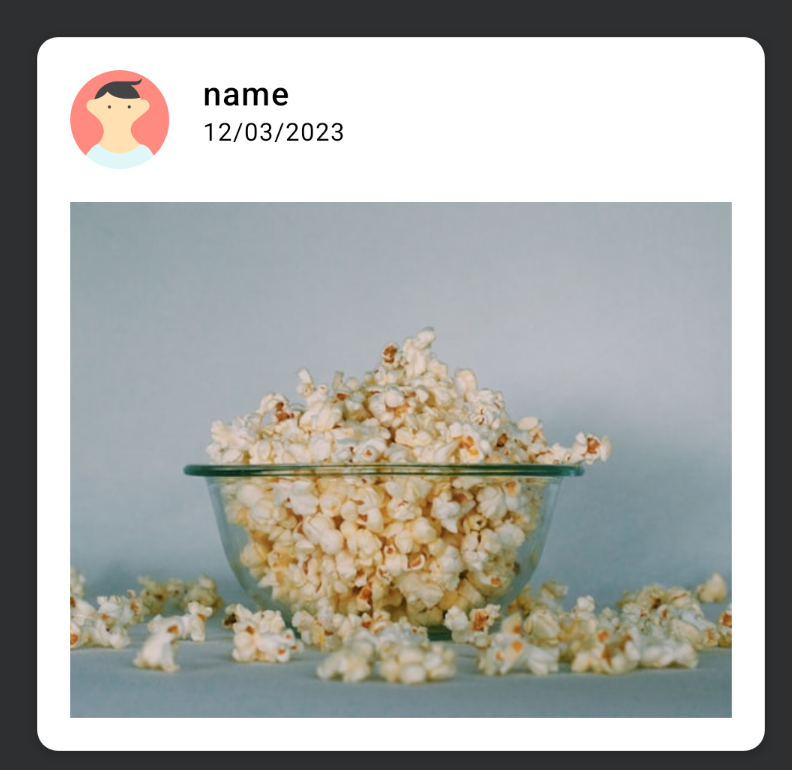

# Exercice 2

## Objectif

Créez un composable "CardPhoto" comme l'exemple ci dessous:



Voici la base :

```kotlin
@Composable
fun CardPhoto() {
   // Déssiner le cadre photo ici
}


@Preview
@Composable
fun CardPhotoPreview() {
    Column(modifier = Modifier.padding(20.dp)) {
        CardPhoto()
    }
}
```
