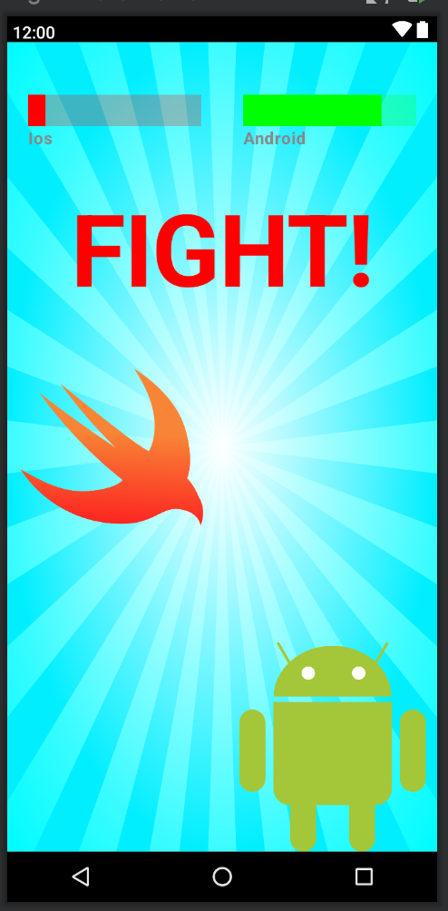

# Exercice 3

## Objectif

Créer cette interface



code exemple :

```kotlin

@Composable
fun FightPhoto() {
    Box() {
        // Dessinez l'écran ici
}


@Preview(device = PIXEL_3_XL, showSystemUi = true)
@Composable
fun FightPhotoPreview() {
    Surface {
        FightPhoto()
    }

}
```
